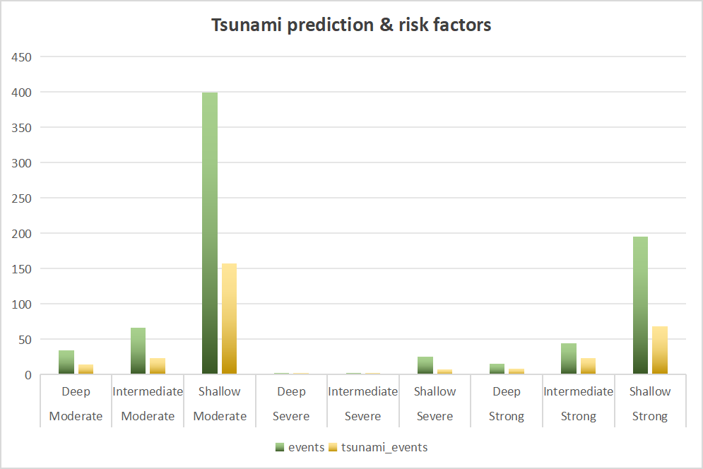
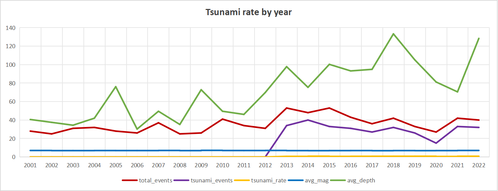
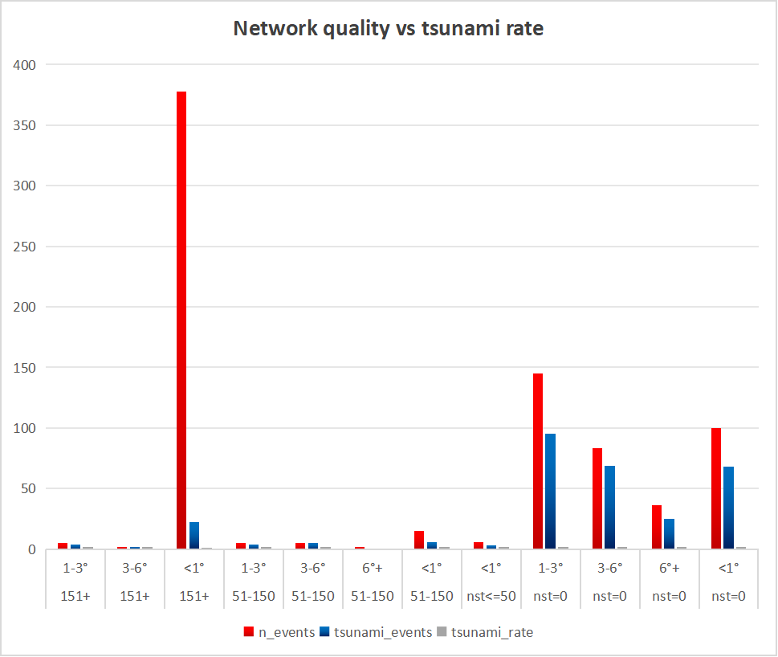

# Earthquake–Tsunami Risk Scoring Project

## Project overview

Goal: use a global earthquake dataset to understand **when, where, and under what conditions** earthquakes generate tsunamis, and to build a simple **tsunami risk score**.

Main pieces:

- **Prepare** – clean the raw earthquake table and create a stable core layer in BigQuery.
- **Process** – engineer reusable features such as magnitude/depth classes and risk/severity indices.
- **Analyze** – answer 5 advanced questions about tsunami drivers, geography, time, network quality, and risk ranking.

All work is done in **BigQuery (SQL)** and charts are created in Excel / BI tools from the query outputs.

---

## Project phases

I follow the same 4-step workflow as in my other SQL projects:

1. **Ask** – define the questions.
2. **Prepare** – clean and standardize the raw data.
3. **Process** – build a processed feature view.
4. **Analyze** – run focused queries and visualize the results.

### 1. Ask

Key analytical questions:

- **Q1 – Why / under what conditions?**  
  Under which combinations of magnitude and depth are tsunamis most likely? Can we see clear drivers?

- **Q2 – Where?**  
  Where on the globe do tsunami-related earthquakes cluster? Which areas are hotspots?

- **Q3 – When?**  
  How do earthquakes and tsunamis evolve over time? Are there visible trends by year?

- **Q4 – How reliable is the data?**  
  Does monitoring network quality (number of stations, distance to nearest station) affect what we observe?

- **Q5 – Can we build a score to rank events?**  
  If we combine magnitude, depth, and significance into a tsunami risk score, does it actually surface the most dangerous events?

These questions drive the structure of the SQL views and queries.

---

### 2. Prepare (core layer)

**Goal:** turn the raw CSV into a clean, analysis-ready table in BigQuery.

**SQL:** (see [`sql/Prepare_Phase.sql`](sql/Prepare_Phase.sql)):

- Load the Kaggle earthquake–tsunami dataset into BigQuery:
  - e.g. `tsunami-risk-assessment.tsunami.earthquake_data_tsunami`
- Filter to realistic ranges from the data card:
  - `magnitude` between **6.5 and 9.1**
  - `depth` between **2.7 and 670.8 km**
  - valid latitude/longitude ranges
- Remove duplicates.
- Build a proper `event_date` from `Year` and `Month`.

This table is the **core layer** used by all later views.

---

### 3. Process (feature view)

**Goal:** engineer features and risk/severity scores on top of the cleaned data.

**SQL:**  (see [`sql/Processed_Phase.sql`](sql/Processed_Phase.sql)):

---

### 4. Analyze

### Tsunami risk by magnitude & depth

To connect the risk score back to physical intuition, I analyze it by **magnitude** and **depth** classes:

- Magnitude classes: `Moderate`, `Strong`, `Severe`
- Depth classes: `Shallow`, `Intermediate`, `Deep`

SQL: [`sql/03_q1_tsunami_risk_factors.sql`](sql/Tsunami_prediction_&_risk_factors.sql)

**Counts by class**

**Tsunami rate and average risk score by class**

These charts show that **shallow, strong/severe earthquakes** both:
- occur frequently near coasts, and  
- have **higher tsunami rates and higher average risk scores**, which validates the scoring logic.

### Geospatial risk hotspots

I project events on the globe to see **where** high-risk earthquakes occur.

SQL: [`sql/04_q2_geopoint_tsunami_rate.sql`](sql/04_q2_geopoint_tsunami_rate.sql)

.png)

Tsunami-prone events clearly align with the **Pacific Ring of Fire** and major subduction zones.

### Temporal behaviour of risk

To understand how risk evolves over time, I compute yearly:

- total events
- tsunami events
- tsunami rate
- average magnitude
- average depth

SQL: [`sql/05_q3_tsunami_rate_by_year.sql`](sql/05_q3_tsunami_rate_by_year.sql)

This provides context for the risk score: some years concentrate more high-risk events,
even if the underlying magnitude/depth distributions stay similar.

### Network quality and observed risk

While the risk score focuses on earthquake properties, the **observed data** is also influenced by
seismic network quality:

- `nst` – number of stations
- `dmin` – distance to nearest station

SQL: [`sql/06_q4_network_quality_vs_tsunami.sql`](sql/06_q4_network_quality_vs_tsunami.sql)

This analysis highlights how **well-instrumented coastal regions** capture more
tsunami-generating events and helps interpret the risk score in the context of monitoring bias.

### Tsunami risk scoring pipeline

Input: processed earthquake view in BigQuery  
(e.g. `tsunami-risk-assessment.tsunami.v_earthquake_processed`)

Output: risk deciles view / table from Q5 query  
(e.g. `q5_risk_score_deciles_lift`)

The **tsunami risk score** is a hand-crafted index designed to approximate how likely an
earthquake is to trigger a tsunami, based on physical and observational factors.

**Dimensions:**

1. Event energy          (magnitude)
2. Rupture depth         (shallower = higher risk)
3. Event significance    (USGS significance score)

The score is computed in the processed view as:

- **Event energy**
  - Higher magnitude ⇒ more seafloor displacement potential  
- **Rupture depth**
  - Uses `1 / (depth + 1)` so **shallow earthquakes** contribute more to the score  
- **Event significance**
  - `sig` is scaled down by `/ 1000` and used as a supporting indicator of importance

Each event receives a continuous `tsunami_risk_score`.  
In the Q5 analysis this score is:

- sorted,
- split into 10 **deciles** using `NTILE(10)`,
- and evaluated via **tsunami rate** and **lift vs overall**.

SQL: see [`sql/07_q5_risk_score_deciles_lift.sql`](sql/07_q5_risk_score_deciles_lift.sql)  
(and the score definition in [`sql/02_processed_view.sql`](sql/02_processed_view.sql)).

### Tsunami risk score distribution

**Deciles & lift**

The chart below shows, for each risk decile:

- `tsunami_rate` – probability of tsunami inside that decile
- `lift_vs_overall` – how many times better than the dataset average the decile is
- `avg_risk_score` – mean risk score in that decile

---

---
This repo is part of my learning portfolio in **SQL, BigQuery, and analytical risk scoring**,
applied to global earthquake–tsunami data.

